<!--
════════════════════════════════════════════════════════════════
  NISHAN_OS // CREATOR PROTOCOL — PROFILE README
  Build: v2.6 | Player: NISHAN GIRI | Handle: @nishan9-99
════════════════════════════════════════════════════════════════

  // CONFIGURATION
  Everything you may want to change lives in plain sight:

  NAME        → Nishan Giri          (hero.svg, player-hud.svg, footer.svg)
  USERNAME    → nishan9-99           (README links, streak widget, badges)
  COLLEGE     → BMS Institute of Technology and Management (player-hud.svg, terminal.svg)
  EDUCATION   → B.Tech CSE           (player-hud.svg, terminal.svg)
  LOCATION    → Bengaluru, India     (player-hud.svg)
  LEVEL / XP  → "PLAYER PROGRESSION" section below (plain text, editable)
  SKILLS      → "CHARACTER ATTRIBUTES" bars below + 3d-module.svg percentages
  SOCIALS     → "COMMS TERMINAL" badges below + comms.svg
  EMAIL       → nishangiree2@gmail.com (badges + comms.svg)
  MISSION     → "CURRENT MISSION" list below
  ACHIEVEMENTS→ achievements.svg (flip LOCKED → UNLOCKED as you earn them)
  PROJECTS    → "QUEST DATABASE" — a ready project template sits in the
                HTML comment inside that section. Copy, fill, uncomment.

  SVG files live in ./assets — edit text directly, no build step.
  Full guide: SETUP.md
════════════════════════════════════════════════════════════════
-->

<p align="center">
  
</p>

> `SYSTEM:` Visitor detected.
> `SYSTEM:` Profile inspection initiated.

<br/>

## `01` // SYSTEM BOOT

<p align="center">
  
</p>

<br/>

## `02` // PLAYER PROFILE

<p align="center">
  
</p>

<p align="center">
  
</p>

<br/>

## `03` // CHARACTER ATTRIBUTES

`CURRENT SELF-ASSESSMENT` — progress indicators are personal, self-assessed and fully customizable. They are not verified skill scores.

```text
C++              █████████████░░░░░   ACTIVE
HTML             ███████████████░░░   ACTIVE
CSS              ███████████████░░░   ACTIVE
VIDEO EDITING    ████████████░░░░░░   ACTIVE
PHOTOSHOP        ████████████░░░░░░   ACTIVE
COLOR GRADING    ███████████░░░░░░░   ACTIVE
3D MODELLING     ██████░░░░░░░░░░░░   LEARNING
GAME DEVELOPMENT █████░░░░░░░░░░░░░   LEARNING
```

<br/>

## `04` // CREATOR SKILL TREE

<p align="center">
  
</p>

<br/>

## `05` // CREATOR LOADOUT

<p align="center">
  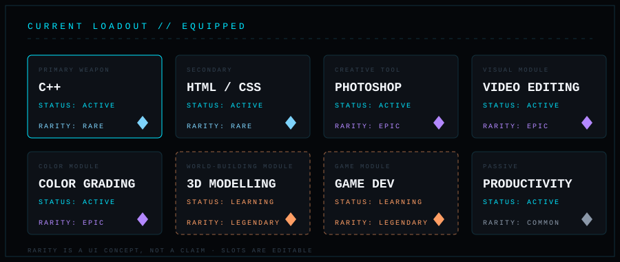
</p>

<br/>

## `06` // CURRENT MISSION

```text
╔════════════════════════════════════════════════════╗
║  MISSION: BUILD THE CREATOR STACK                  ║
╚════════════════════════════════════════════════════╝
```

**PRIMARY OBJECTIVES**

- `[ ACTIVE ]` Strengthen programming fundamentals
- `[ ACTIVE ]` Explore C++
- `[ ACTIVE ]` Build with HTML/CSS
- `[ LEARNING ]` 3D Modelling
- `[ LEARNING ]` Game Development
- `[ FUTURE ]` Build larger interactive experiences

<br/>

## `07` // CREATOR MODE

<p align="center">
  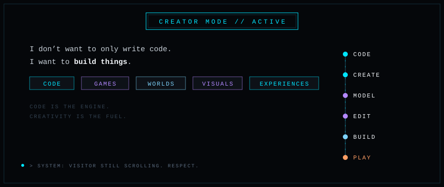
</p>

<br/>

## `08` // 3D WORLD-BUILDING MODULE

<p align="center">
  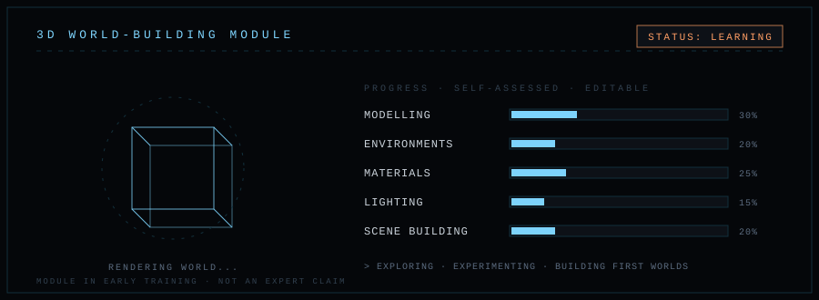
</p>

<br/>

## `09` // GAME DEVELOPMENT MODULE

<p align="center">
  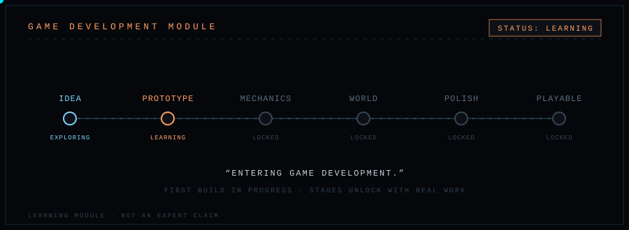
</p>

<br/>

## `10` // CREATIVE ARSENAL

```text
  VIDEO EDITING      TYPE: CREATIVE ABILITY     STATUS: EQUIPPED
  PHOTOSHOP          TYPE: DESIGN ABILITY       STATUS: EQUIPPED
  COLOR GRADING      TYPE: VISUAL ABILITY       STATUS: EQUIPPED
  PRODUCTIVITY       TYPE: PASSIVE ABILITY      STATUS: ALWAYS ON
```

<br/>

## `11` // BOSS DATABASE

Developer problems, classified as bosses.

| BOSS | HP | STATUS |
|---|---|---|
| "WHY IS IT NOT WORKING?" | `██████████░░░░░░░░░░` | `ACTIVE` |
| "ONE SMALL BUG" | `████████████████████` | `ENGAGED` |
| "IT WORKED YESTERDAY" | `██████████████░░░░░░` | `DANGEROUS` |
| "DEADLINE" | `████████████████░░░░` | `APPROACHING` |
| "SLEEP" | `██░░░░░░░░░░░░░░░░░░` | `OPTIONAL ☠️` |

<br/>

## `12` // AURA // SYSTEM

<p align="center">
  
</p>

<br/>

## `13` // ACHIEVEMENT DATABASE

<p align="center">
  
</p>

> Achievements flip to `UNLOCKED` only when real work earns them. Edit `assets/achievements.svg` to unlock.

<br/>

## `14` // PLAYER INVENTORY

<p align="center">
  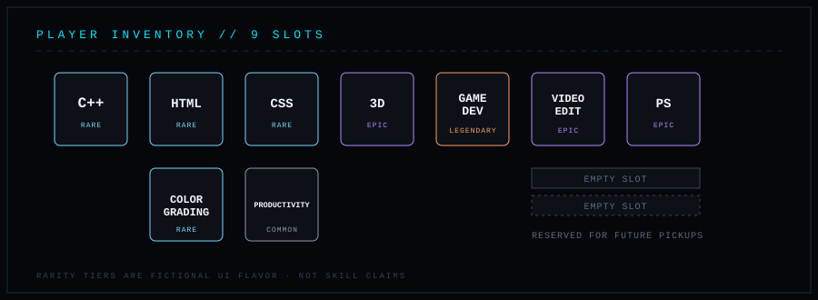
</p>

<br/>

## `15` // PLAYER PROGRESSION

```text
LEVEL        : 03            // edit as you grow
XP           : [ CUSTOMIZE ] // your call
NEXT LEVEL   : [ CUSTOMIZE ]

XP SOURCES   : PROJECTS · LEARNING · EXPERIMENTS
               PROBLEM SOLVING · CREATIVE WORK · GAME DEVELOPMENT
```

> `SYSTEM:` You are still scrolling.
> `SYSTEM:` Respect.

<br/>

## `16` // GITHUB // CORE SYSTEM

<p align="center">
  <a href="https://github.com/nishan9-99">
    
  </a>
</p>

<p align="center">
  
</p>

<!--
  MORE LIVE STATS (optional):
  The github-readme-stats service is a popular add-on but was returning
  errors when this README was built. To try enabling it, uncomment and
  keep it ONLY if it loads for you:

  <p align="center">
    
    
  </p>

  If it ever fails to load, the profile still stands on its own.
  Fallback: DATA STREAM: AWAITING LIVE SIGNAL
-->

<br/>

## `17` // CONTRIBUTION COMBO

```text
   CODE
     ↓
   COMMIT
     ↓
   PUSH
     ↓
   BUILD
     ↓
   REPEAT  ▶▶▶
```

`COMBO: TRACKING...` — the live streak above is the real data. No fake numbers here.

<br/>

## `18` // NISHAN_TERMINAL

<p align="center">
  
</p>

<br/>

## `19` // MISSION ROADMAP

<p align="center">
  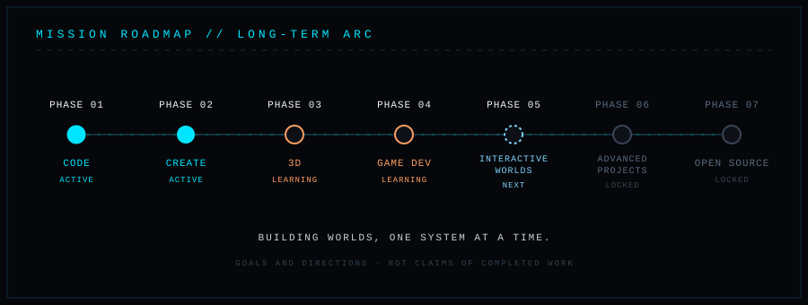
</p>

<br/>

## `20` // SYSTEM LOG

<p align="center">
  
</p>

<br/>

## `21` // QUEST DATABASE

```text
╔════════════════════════════════════════════════════╗
║  PROJECT MODULE: LOCKED                            ║
║  STATUS: PROJECTS UNDER DEVELOPMENT                ║
╚════════════════════════════════════════════════════╝
```

**`> New missions will appear here.`**

Currently in the lab. First quests drop when they are real.

<!--
  FUTURE PROJECT SLOT — copy this block per project, fill it, uncomment:

  ### `[STATUS] PROJECT NAME`
  One-line description of what it does.
  - `TECH` stack · list · here
  - `DIFFICULTY` BOSS TIER
  - `MISSION REWARD` what you learned / shipped
  - [GITHUB](repo-url) · [LIVE DEMO](demo-url)
  
-->

<br/>

## `22` // COMMS TERMINAL

<p align="center">
  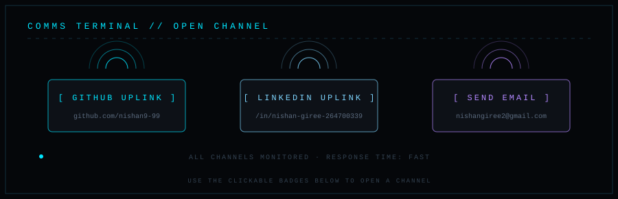
</p>

<p align="center">
  <a href="https://github.com/nishan9-99"></a>
  <a href="https://www.linkedin.com/in/nishan-giree-264700339/"></a>
  <a href="mailto:nishangiree2@gmail.com"></a>
</p>

<br/>

## `23` // CLASSIFIED FILES

<details>
<summary><code>CLASSIFIED FILE #01 — AURA REPORT</code></summary>
<br/>

```text
SUBJECT: PLAYER 01
FINDING: AURA EXCEEDS RECOMMENDED LIMITS.
ACTION: NONE. LET HIM COOK.
```

</details>

<details>
<summary><code>CLASSIFIED FILE #02 — DEVELOPER SECRET</code></summary>
<br/>

```text
THE README WAS THE TUTORIAL LEVEL.
THE PROJECTS ARE THE GAME.
```

</details>

<details>
<summary><code>CLASSIFIED FILE #03 — BOSS INTEL</code></summary>
<br/>

```text
BOSS "ONE SMALL BUG" HAS NEVER BEEN DEFEATED IN ONE HIT.
DOCUMENTED SURVIVORS: 0
```

</details>

<details>
<summary><code>CLASSIFIED FILE #04 — UNKNOWN SIGNAL</code></summary>
<br/>

```text
INCOMING TRANSMISSION:
"CURRENTLY LEARNING. ALWAYS BUILDING."
SOURCE: BENGALURU, INDIA
```

</details>

<details>
<summary><code>CLASSIFIED FILE #05 — SYSTEM AUDIO</code></summary>
<br/>

```text
AUDIO CHANNEL: OFFLINE
[ ▶ PROFILE THEME ] — slot reserved. Drop a link here later.
```

</details>

<details>
<summary><code>CLASSIFIED FILE #06 — VISITOR LOG</code></summary>
<br/>

```text
ENTRY #0001: YOU MADE IT TO THE CLASSIFIED SECTION.
CLEARANCE: GRANTED.
```

</details>

<br/>

<p align="center">
  
</p>

