 

      

 

  

## `> toolchain.status`

## `> projects --list`

<table><tr>
<td></td>
<td></td>
</tr><tr>
<td></td>
<td></td>
</tr></table>

## `> stats --live`

 

 

<code>stats refresh automatically from the GitHub API. built by Nishan Giri (Fragger).</code>

