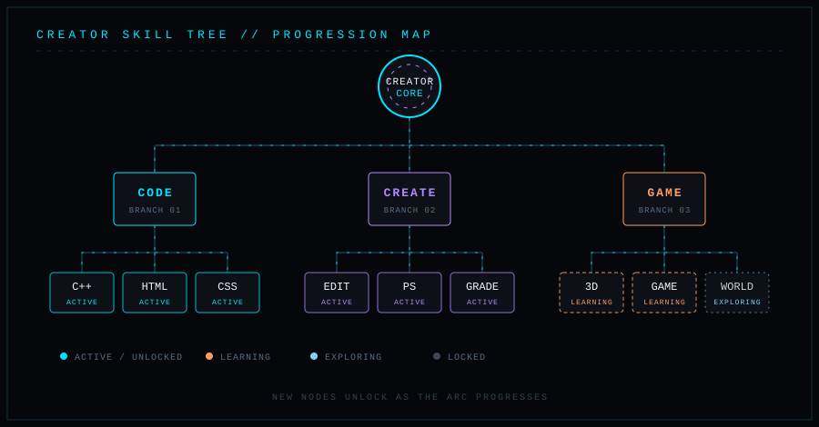

PLAYER PROFILE // COMPLETE SOURCE BUNDLE

Copy each FILE block into the exact path shown. README.md is the root file; all eight SVGs belong inside assets/. Read SETUP.md last. Do not paste this entire bundle into GitHub as one README.


============================ BEGIN FILE: README.md ============================
<!--
PLAYER CONFIG // change the entries below before publishing.
YOUR_NAME = Nishan Giri (verified)
YOUR_USERNAME = nishan9-99 (verified)
YOUR_LOCATION = Nepal
YOUR_ROLE = Student / learning game development (verified; edit if changed)
YOUR_EMAIL = nishangiree2@gmail.com (from your previous profile README)
YOUR_LINKEDIN = https://www.linkedin.com/in/nishan-giree-264700339/ (from your previous profile README)
YOUR_PORTFOLIO = [ADD PORTFOLIO URL WHEN READY]
YOUR_YOUTUBE = [ADD YOUTUBE URL WHEN READY]
YOUR_PROJECTS = three blank QUEST slots below; replace only with real projects
YOUR_SKILLS = HTML, CSS, JavaScript, TypeScript, Python, React, Node.js, Git, VS Code (from your previous profile README)
LEVEL / XP / RANK / INVENTORY / ACHIEVEMENTS = unset or locked until you choose honest values.
Also update the visible labels inside assets/*.svg when changing your identity, quests or skills.
-->

<!-- SYSTEM NAV / links use normal GitHub fragment anchors -->
<p align="center">
  
</p>

<p align="center">
  <a href="#player-file">PLAYER</a> ·
  <a href="#skill-database">SKILLS</a> ·
  <a href="#quest-log">QUESTS</a> ·
  <a href="#power-level">STATS</a> ·
  <a href="#comms-terminal">COMMS</a>
</p>

<p align="center"><strong>PLAYER PROFILE // SYSTEM ONLINE</strong><br>
Student. Learning game development. Aspiring founder.<br>
<code>I BUILD / I LEARN / I EXPERIMENT / I SHIP / I KEEP LEVELING UP</code></p>

<details>
<summary>01 / OPEN THE BOOT LOG</summary>

```text
[■■■■■■■■■■■■■■■■■■■■] 100%   BOOT COMPLETE
> INITIALIZING PLAYER PROFILE... OK
> LOADING SKILL DATABASE....... OK
> CONNECTING TO GITHUB........ READY
> CALIBRATING LOADOUT........ READY
> SYSTEM ONLINE.
```

This is a themed introduction, not a live diagnostic or a claim about GitHub uptime.
</details>

<p align="center"></p>

## PLAYER FILE

<p align="center"></p>

| PLAYER RECORD | DATA |
| :-- | :-- |
| Name / handle | Nishan Giri / [@nishan9-99](https://github.com/nishan9-99) |
| Class / status | Student learning game development / learning and building |
| Location / rank | `[SET LOCATION]` / `[SET RANK]` |
| Level / XP | `[SET LEVEL]` / `[SET XP]` |

### XP PROTOCOL

```text
LEVEL [SET LEVEL]  |  XP [SET XP] / [SET XP TARGET]
[? ? ? ? ? ? ? ? ? ?]   TRACKING DISABLED UNTIL CONFIGURED
NEXT LEVEL: [SET NEXT MILESTONE]
```

XP can mean projects shipped, technologies learned, open-source work, hackathons, problem solving, or experiments. Set your own scale; none of those achievements is claimed here.

<p align="center"></p>

## SKILL DATABASE

<p align="center"></p>

```text
CORE / CODE      ├─ JavaScript ├─ TypeScript └─ Python
WEB              ├─ HTML       ├─ CSS        ├─ React └─ Node.js
TOOLS            ├─ Git        └─ VS Code
NEXT BRANCH      └─ Game development [LEARNING]
LOCKED BRANCHES  └─ Database / AI / algorithms [ADD ONLY IF TRUE]
```

<details>
<summary>SKILL POINT ALLOCATION // optional, self-assessed</summary>

```text
[SET SKILL]       [----------]  [SET %]
[SET SKILL]       [----------]  [SET %]
[SET SKILL]       [----------]  [SET %]
```

Values are intentionally unset. Edit the bars and percentages together if you want a self-rated scale.
</details>

## QUEST LOG

<p align="center"></p>

<details>
<summary>QUEST 001 // [PROJECT NAME] · [STATUS]</summary>

**Mission:** [PROJECT DESCRIPTION]  
**Difficulty:** [SET DIFFICULTY]  
**Stack:** [PROJECT TECH STACK]  
**Source code:** [Add a real repository URL when ready]  
**Live demo:** [Add a real deployed URL when ready]
</details>

<details>
<summary>QUEST 002 // [PROJECT NAME] · [STATUS]</summary>

**Mission:** [PROJECT DESCRIPTION]  
**Difficulty:** [SET DIFFICULTY]  
**Stack:** [PROJECT TECH STACK]  
**Source code:** [Add a real repository URL when ready]  
**Live demo:** [Add a real deployed URL when ready]
</details>

<details>
<summary>QUEST 003 // [PROJECT NAME] · [STATUS]</summary>

**Mission:** [PROJECT DESCRIPTION]  
**Difficulty:** [SET DIFFICULTY]  
**Stack:** [PROJECT TECH STACK]  
**Source code:** [Add a real repository URL when ready]  
**Live demo:** [Add a real deployed URL when ready]
</details>

> EMPTY QUEST SLOTS. Replace a slot with a real project, then add its actual source and demo links. There are no fake demos here.

### BOSS FIGHTS // technical challenge board

| BOSS | HP | STATUS |
| :-- | :-- | :-- |
| `[SET REAL TECHNICAL CHALLENGE]` | `[SET HP]` | `[SET STATUS]` |
| `[SET REAL TECHNICAL CHALLENGE]` | `[SET HP]` | `[SET STATUS]` |
| "Works on my machine" | `????????` | RECURRING FOE / joke, not a personal accomplishment |

### CURRENT MISSION

```text
MISSION   /  Learning game development
OBJECTIVE /  Turn ideas into working software
PROGRESS  /  [SET REAL MILESTONE]
THREATS   /  Bugs, deadlines, and the occasional typo
REWARD    /  Experience, not an invented XP score
```

## ACHIEVEMENT VAULT

<p align="center"></p>

| STATUS | ACHIEVEMENT | UNLOCK CONDITION |
| :-- | :-- | :-- |
| 🔒 LOCKED | First Deploy | Ship a real public project |
| 🔒 LOCKED | Bug Hunter | Document a hard fix |
| 🔒 LOCKED | Open Source | Get a contribution merged |

Unlock these only after the events happen. The cards are goals, not a résumé.

### PLAYER INVENTORY // pick only what is yours

| SLOT | ITEM | RARITY |
| :-- | :-- | :-- |
| Verified tool | Git + VS Code | COMMON |
| Mindset | Curiosity | LEGENDARY / flavor text |
| Custom item | `[SET ITEM YOU OWN]` | `[SET RARITY]` |
| Custom item | `[SET ITEM YOU OWN]` | `[SET RARITY]` |

### CURRENT LOADOUT // metaphor, not technical certification

```text
PRIMARY   /  Building and learning
SECONDARY /  Game development [LEARNING]
SPECIAL   /  [SET REAL STRENGTH]
PASSIVE   /  Curiosity
ULTIMATE  /  [SET LONG-TERM GOAL]
```

## POWER LEVEL

These images request live data for **nishan9-99**. Counts belong to GitHub or the widget, not to a hand-written claim. New accounts may show empty language data.

<p align="center">
  
</p>

<p align="center">
  
  
</p>

<p align="center">
  
</p>

<p align="center"></p>

If an external widget is unavailable, use your [GitHub profile](https://github.com/nishan9-99) and its native contribution calendar. Remove the broken widget line until the service returns. The profile-details card is an activity summary; GitHub's actual contribution heatmap is on the profile page.

### CONTRIBUTION COMBO

```text
START  →  CODE  →  COMMIT  →  PUSH  →  REPEAT
COMBO METER: [LIVE STREAK IN THE CARD ABOVE, NOT A CLAIM HERE]
```

## TERMINAL

```text
$ whoami
> nishan9-99 / Nishan Giri

$ class
> student // game development learner // aspiring founder

$ mission
> turn ideas into working software

$ next
> unknown; exploring

$ coffee
> optional power-up

_ █
```

`[LOG 01]` The next useful commit beats a fictional level.  
`[LOG 02]` Real projects replace empty quest slots.  
`[LOG 03]` Keep shipping.

### MISSION ROADMAP // goals, not completed milestones

```text
[01] LEARN → [02] BUILD → [03] DEPLOY
                          ↓
[06] CREATE SOMETHING MASSIVE ← [05] OPEN SOURCE ← [04] CONTRIBUTE
```

## COMMS TERMINAL

| CHANNEL | UPLINK |
| :-- | :-- |
| GitHub | [Open Nishan's GitHub profile](https://github.com/nishan9-99) |
| LinkedIn | [Connect with Nishan on LinkedIn](https://www.linkedin.com/in/nishan-giree-264700339/) |
| Email | [Email Nishan](mailto:nishangiree@gmail.com) |
| Portfolio | `[ADD PORTFOLIO URL WHEN READY]` |
| YouTube | `[ADD YOUTUBE URL WHEN READY]` |

<details>
<summary>CLASSIFIED FILE // ACCESS?</summary>

`ACHIEVEMENT: CURIOUS PLAYER` - you found the fold. No personal achievements were awarded.
</details>

<details>
<summary>DATABASE QUERY // SELECT * FROM dreams</summary>

```text
result: one next project, details pending.
```
</details>

<details>
<summary>SECRET INPUT // UP UP DOWN DOWN</summary>

No cheat code. Build the next thing and the level unlocks itself.
</details>

<p align="center"></p>

<p align="center"><strong>PLAYER HAS LEFT THE TERMINAL.</strong><br>
<code>END OF TRANSMISSION_</code><br>
Built with curiosity and code.</p>

============================ END FILE: README.md ============================

============================ BEGIN FILE: assets/achievements.svg ============================
<svg xmlns="http://www.w3.org/2000/svg" width="800" height="320" viewBox="0 0 800 320" role="img" aria-label="Three locked achievement placeholders">
 <title>Three locked achievement placeholders</title><defs><linearGradient id="edge"><stop stop-color="#59e9f2"/><stop offset="1" stop-color="#ab78fb"/></linearGradient><linearGradient id="ground" x2="1" y2="1"><stop stop-color="#090c19"/><stop offset="1" stop-color="#15132c"/></linearGradient><pattern id="grid" width="32" height="32" patternUnits="userSpaceOnUse"><path d="M32 0H0V32" fill="none" stroke="#26304a" stroke-width=".7"/></pattern></defs>
 <rect width="100%" height="100%" rx="16" fill="url(#ground)"/><rect width="100%" height="100%" rx="16" fill="url(#grid)" opacity=".55"/><rect x="7" y="7" width="786" height="306" rx="12" fill="none" stroke="url(#edge)" stroke-width="1.5"/><path d="M24 44V24H84 M716 24H776V44 M24 276V296H84 M716 296H776V276" fill="none" stroke="#59e9f2" stroke-width="2"/>
 <text x="45" y="58" fill="#59e9f2" font-family="Arial,Helvetica,sans-serif" font-size="17" font-weight="700" text-anchor="start" letter-spacing="1">ACHIEVEMENTS // LOCKED UNTIL EARNED</text><rect x="42" y="88" width="224" height="160" rx="9" fill="#11172a" stroke="#485475"/><circle cx="154" cy="136" r="25" stroke="#ab78fb" fill="none"/><text x="154" y="143" fill="#59e9f2" font-family="Arial,Helvetica,sans-serif" font-size="25" font-weight="700" text-anchor="middle" letter-spacing="1">?</text><text x="154" y="187" fill="#edf6ff" font-family="Arial,Helvetica,sans-serif" font-size="16" font-weight="700" text-anchor="middle" letter-spacing="1">FIRST DEPLOY</text><text x="154" y="215" fill="#9aaac4" font-family="Arial,Helvetica,sans-serif" font-size="12" font-weight="500" text-anchor="middle" letter-spacing="1">Ship a public project</text><rect x="287" y="88" width="224" height="160" rx="9" fill="#11172a" stroke="#485475"/><circle cx="399" cy="136" r="25" stroke="#ab78fb" fill="none"/><text x="399" y="143" fill="#59e9f2" font-family="Arial,Helvetica,sans-serif" font-size="25" font-weight="700" text-anchor="middle" letter-spacing="1">?</text><text x="399" y="187" fill="#edf6ff" font-family="Arial,Helvetica,sans-serif" font-size="16" font-weight="700" text-anchor="middle" letter-spacing="1">BUG HUNTER</text><text x="399" y="215" fill="#9aaac4" font-family="Arial,Helvetica,sans-serif" font-size="12" font-weight="500" text-anchor="middle" letter-spacing="1">Document a hard fix</text><rect x="532" y="88" width="224" height="160" rx="9" fill="#11172a" stroke="#485475"/><circle cx="644" cy="136" r="25" stroke="#ab78fb" fill="none"/><text x="644" y="143" fill="#59e9f2" font-family="Arial,Helvetica,sans-serif" font-size="25" font-weight="700" text-anchor="middle" letter-spacing="1">?</text><text x="644" y="187" fill="#edf6ff" font-family="Arial,Helvetica,sans-serif" font-size="16" font-weight="700" text-anchor="middle" letter-spacing="1">OPEN SOURCE</text><text x="644" y="215" fill="#9aaac4" font-family="Arial,Helvetica,sans-serif" font-size="12" font-weight="500" text-anchor="middle" letter-spacing="1">Merged contribution</text><text x="45" y="288" fill="#9aaac4" font-family="Arial,Helvetica,sans-serif" font-size="14" font-weight="500" text-anchor="start" letter-spacing="1">All slots are locked placeholders; unlock only after the real milestone.</text></svg>
============================ END FILE: assets/achievements.svg ============================

============================ BEGIN FILE: assets/footer.svg ============================
<svg xmlns="http://www.w3.org/2000/svg" width="800" height="260" viewBox="0 0 800 260" role="img" aria-label="End of transmission with animated signal line">
 <title>End of transmission with animated signal line</title><defs><linearGradient id="edge"><stop stop-color="#59e9f2"/><stop offset="1" stop-color="#ab78fb"/></linearGradient><linearGradient id="ground" x2="1" y2="1"><stop stop-color="#090c19"/><stop offset="1" stop-color="#15132c"/></linearGradient><pattern id="grid" width="32" height="32" patternUnits="userSpaceOnUse"><path d="M32 0H0V32" fill="none" stroke="#26304a" stroke-width=".7"/></pattern></defs>
 <rect width="100%" height="100%" rx="16" fill="url(#ground)"/><rect width="100%" height="100%" rx="16" fill="url(#grid)" opacity=".55"/><rect x="7" y="7" width="786" height="246" rx="12" fill="none" stroke="url(#edge)" stroke-width="1.5"/><path d="M24 44V24H84 M716 24H776V44 M24 216V236H84 M716 236H776V216" fill="none" stroke="#59e9f2" stroke-width="2"/>
 <text x="400" y="86" fill="#edf6ff" font-family="Arial,Helvetica,sans-serif" font-size="34" font-weight="800" text-anchor="middle" letter-spacing="3">END OF TRANSMISSION_</text><text x="400" y="137" fill="#59e9f2" font-family="Arial,Helvetica,sans-serif" font-size="17" font-weight="700" text-anchor="middle" letter-spacing="1">I BUILD  /  I LEARN  /  I EXPERIMENT  /  I SHIP</text><text x="400" y="181" fill="#9aaac4" font-family="Arial,Helvetica,sans-serif" font-size="14" font-weight="600" text-anchor="middle" letter-spacing="1">SIGNAL ACTIVE   •   NEXT LEVEL PENDING</text><path d="M100 217H700" stroke="#ab78fb" stroke-width="2" stroke-dasharray="30 12"><animate attributeName="stroke-dashoffset" values="0;-42" dur="2s" repeatCount="indefinite"/></path></svg>
============================ END FILE: assets/footer.svg ============================

============================ BEGIN FILE: assets/hero.svg ============================
<svg xmlns="http://www.w3.org/2000/svg" width="800" height="360" viewBox="0 0 800 360" role="img" aria-label="Player Profile: Nishan Giri, system online">
 <title>Player Profile: Nishan Giri, system online</title><defs><linearGradient id="edge"><stop stop-color="#59e9f2"/><stop offset="1" stop-color="#ab78fb"/></linearGradient><linearGradient id="ground" x2="1" y2="1"><stop stop-color="#090c19"/><stop offset="1" stop-color="#15132c"/></linearGradient><pattern id="grid" width="32" height="32" patternUnits="userSpaceOnUse"><path d="M32 0H0V32" fill="none" stroke="#26304a" stroke-width=".7"/></pattern></defs>
 <rect width="100%" height="100%" rx="16" fill="url(#ground)"/><rect width="100%" height="100%" rx="16" fill="url(#grid)" opacity=".55"/><rect x="7" y="7" width="786" height="346" rx="12" fill="none" stroke="url(#edge)" stroke-width="1.5"/><path d="M24 44V24H84 M716 24H776V44 M24 316V336H84 M716 336H776V316" fill="none" stroke="#59e9f2" stroke-width="2"/>
 <text x="50" y="68" fill="#59e9f2" font-family="Arial,Helvetica,sans-serif" font-size="17" font-weight="700" text-anchor="start" letter-spacing="1">N/99  //  PRIVATE TERMINAL</text><text x="750" y="68" fill="#9aaac4" font-family="Arial,Helvetica,sans-serif" font-size="15" font-weight="600" text-anchor="end" letter-spacing="1">v 01.00  |  ONLINE</text><text x="400" y="142" fill="#edf6ff" font-family="Arial,Helvetica,sans-serif" font-size="43" font-weight="800" text-anchor="middle" letter-spacing="2">PLAYER PROFILE</text><text x="400" y="190" fill="#59e9f2" font-family="Arial,Helvetica,sans-serif" font-size="30" font-weight="700" text-anchor="middle" letter-spacing="5">NISHAN GIRI</text><text x="400" y="226" fill="#9aaac4" font-family="Arial,Helvetica,sans-serif" font-size="15" font-weight="600" text-anchor="middle" letter-spacing="2">SYSTEM ONLINE  //  BUILD THE NEXT LEVEL</text><circle cx="400" cy="180" r="128" fill="none" stroke="#556188" opacity=".3" stroke-dasharray="3 9"/><circle cx="400" cy="180" r="145" fill="none" stroke="#ab78fb" opacity=".4" stroke-dasharray="70 190"><animateTransform attributeName="transform" type="rotate" from="0 400 180" to="360 400 180" dur="24s" repeatCount="indefinite"/></circle><path d="M50 264L750 264" stroke="#ab78fb" stroke-width="1" fill="none"/><text x="52" y="297" fill="#9aaac4" font-family="Arial,Helvetica,sans-serif" font-size="11" font-weight="500" text-anchor="start" letter-spacing="1">01 / SKILL DATABASE</text><text x="400" y="297" fill="#9aaac4" font-family="Arial,Helvetica,sans-serif" font-size="11" font-weight="middle" text-anchor="start" letter-spacing="1">02 / QUEST LOG</text><text x="748" y="297" fill="#59e9f2" font-family="Arial,Helvetica,sans-serif" font-size="11" font-weight="600" text-anchor="end" letter-spacing="1">03 / UPLINK READY</text><rect x="50" y="325" width="700" height="5" rx="2" fill="#28314d"/><rect x="50" y="325" width="700" height="5" rx="2" fill="#59e9f2"><animate attributeName="width" values="0;700;700" dur="3s" repeatCount="indefinite"/></rect><path d="M0 22H800" stroke="#59e9f2" opacity=".3"><animate attributeName="d" values="M0 22H800;M0 348H800;M0 22H800" dur="9s" repeatCount="indefinite"/></path></svg>
============================ END FILE: assets/hero.svg ============================

============================ BEGIN FILE: assets/player-card.svg ============================
<svg xmlns="http://www.w3.org/2000/svg" width="800" height="425" viewBox="0 0 800 425" role="img" aria-label="Player card for Nishan Giri with editable rank, location and level">
 <title>Player card for Nishan Giri with editable rank, location and level</title><defs><linearGradient id="edge"><stop stop-color="#59e9f2"/><stop offset="1" stop-color="#ab78fb"/></linearGradient><linearGradient id="ground" x2="1" y2="1"><stop stop-color="#090c19"/><stop offset="1" stop-color="#15132c"/></linearGradient><pattern id="grid" width="32" height="32" patternUnits="userSpaceOnUse"><path d="M32 0H0V32" fill="none" stroke="#26304a" stroke-width=".7"/></pattern></defs>
 <rect width="100%" height="100%" rx="16" fill="url(#ground)"/><rect width="100%" height="100%" rx="16" fill="url(#grid)" opacity=".55"/><rect x="7" y="7" width="786" height="411" rx="12" fill="none" stroke="url(#edge)" stroke-width="1.5"/><path d="M24 44V24H84 M716 24H776V44 M24 381V401H84 M716 401H776V381" fill="none" stroke="#59e9f2" stroke-width="2"/>
 <text x="42" y="62" fill="#59e9f2" font-family="Arial,Helvetica,sans-serif" font-size="17" font-weight="700" text-anchor="start" letter-spacing="1">IDENTITY // PLAYER 01</text><path d="M42 78L758 78" stroke="#ab78fb" stroke-width="1" fill="none"/><text x="48" y="120" fill="#9aaac4" font-family="Arial,Helvetica,sans-serif" font-size="14" font-weight="700" text-anchor="start" letter-spacing="1">NAME</text><text x="252" y="120" fill="#edf6ff" font-family="Arial,Helvetica,sans-serif" font-size="19" font-weight="600" text-anchor="start" letter-spacing="1">Nishan Giri</text><text x="48" y="163" fill="#9aaac4" font-family="Arial,Helvetica,sans-serif" font-size="14" font-weight="700" text-anchor="start" letter-spacing="1">HANDLE</text><text x="252" y="163" fill="#edf6ff" font-family="Arial,Helvetica,sans-serif" font-size="19" font-weight="600" text-anchor="start" letter-spacing="1">@nishan9-99</text><text x="48" y="206" fill="#9aaac4" font-family="Arial,Helvetica,sans-serif" font-size="14" font-weight="700" text-anchor="start" letter-spacing="1">CLASS</text><text x="252" y="206" fill="#edf6ff" font-family="Arial,Helvetica,sans-serif" font-size="19" font-weight="600" text-anchor="start" letter-spacing="1">Student / learning game development</text><text x="48" y="249" fill="#9aaac4" font-family="Arial,Helvetica,sans-serif" font-size="14" font-weight="700" text-anchor="start" letter-spacing="1">LOCATION</text><text x="252" y="249" fill="#edf6ff" font-family="Arial,Helvetica,sans-serif" font-size="19" font-weight="600" text-anchor="start" letter-spacing="1">[SET LOCATION]</text><text x="48" y="292" fill="#9aaac4" font-family="Arial,Helvetica,sans-serif" font-size="14" font-weight="700" text-anchor="start" letter-spacing="1">RANK</text><text x="252" y="292" fill="#edf6ff" font-family="Arial,Helvetica,sans-serif" font-size="19" font-weight="600" text-anchor="start" letter-spacing="1">[SET RANK]</text><text x="48" y="335" fill="#9aaac4" font-family="Arial,Helvetica,sans-serif" font-size="14" font-weight="700" text-anchor="start" letter-spacing="1">LEVEL + XP</text><text x="252" y="335" fill="#edf6ff" font-family="Arial,Helvetica,sans-serif" font-size="19" font-weight="600" text-anchor="start" letter-spacing="1">[SET LEVEL] / [SET XP]</text><rect x="580" y="373" width="102" height="30" rx="15" fill="#1c2640" stroke="#59e9f2"/><text x="595" y="393" fill="#59e9f2" font-family="Arial,Helvetica,sans-serif" font-size="13" font-weight="700" text-anchor="start" letter-spacing="1">BUILDING</text><circle cx="555" cy="383" r="5" fill="#59e9f2"><animate attributeName="opacity" values="1;.15;1" dur="1.7s" repeatCount="indefinite"/></circle></svg>
============================ END FILE: assets/player-card.svg ============================

============================ BEGIN FILE: assets/quest.svg ============================
<svg xmlns="http://www.w3.org/2000/svg" width="800" height="415" viewBox="0 0 800 415" role="img" aria-label="Three unassigned project quest slots">
 <title>Three unassigned project quest slots</title><defs><linearGradient id="edge"><stop stop-color="#59e9f2"/><stop offset="1" stop-color="#ab78fb"/></linearGradient><linearGradient id="ground" x2="1" y2="1"><stop stop-color="#090c19"/><stop offset="1" stop-color="#15132c"/></linearGradient><pattern id="grid" width="32" height="32" patternUnits="userSpaceOnUse"><path d="M32 0H0V32" fill="none" stroke="#26304a" stroke-width=".7"/></pattern></defs>
 <rect width="100%" height="100%" rx="16" fill="url(#ground)"/><rect width="100%" height="100%" rx="16" fill="url(#grid)" opacity=".55"/><rect x="7" y="7" width="786" height="401" rx="12" fill="none" stroke="url(#edge)" stroke-width="1.5"/><path d="M24 44V24H84 M716 24H776V44 M24 371V391H84 M716 391H776V371" fill="none" stroke="#59e9f2" stroke-width="2"/>
 <text x="45" y="56" fill="#59e9f2" font-family="Arial,Helvetica,sans-serif" font-size="17" font-weight="700" text-anchor="start" letter-spacing="1">QUEST LOG // EMPTY SLOTS</text><rect x="44" y="82" width="712" height="72" rx="9" fill="#11172a" stroke="#ab78fb"/><text x="63" y="111" fill="#59e9f2" font-family="Arial,Helvetica,sans-serif" font-size="14" font-weight="700" text-anchor="start" letter-spacing="1">QUEST 01</text><text x="235" y="111" fill="#edf6ff" font-family="Arial,Helvetica,sans-serif" font-size="19" font-weight="700" text-anchor="start" letter-spacing="1">[PROJECT NAME]</text><text x="235" y="135" fill="#9aaac4" font-family="Arial,Helvetica,sans-serif" font-size="13" font-weight="500" text-anchor="start" letter-spacing="1">[STATUS]  /  [STACK]  /  [LINKS]</text><rect x="44" y="170" width="712" height="72" rx="9" fill="#11172a" stroke="#40506d"/><text x="63" y="199" fill="#59e9f2" font-family="Arial,Helvetica,sans-serif" font-size="14" font-weight="700" text-anchor="start" letter-spacing="1">QUEST 02</text><text x="235" y="199" fill="#edf6ff" font-family="Arial,Helvetica,sans-serif" font-size="19" font-weight="700" text-anchor="start" letter-spacing="1">[PROJECT NAME]</text><text x="235" y="223" fill="#9aaac4" font-family="Arial,Helvetica,sans-serif" font-size="13" font-weight="500" text-anchor="start" letter-spacing="1">[STATUS]  /  [STACK]  /  [LINKS]</text><rect x="44" y="258" width="712" height="72" rx="9" fill="#11172a" stroke="#40506d"/><text x="63" y="287" fill="#59e9f2" font-family="Arial,Helvetica,sans-serif" font-size="14" font-weight="700" text-anchor="start" letter-spacing="1">QUEST 03</text><text x="235" y="287" fill="#edf6ff" font-family="Arial,Helvetica,sans-serif" font-size="19" font-weight="700" text-anchor="start" letter-spacing="1">[PROJECT NAME]</text><text x="235" y="311" fill="#9aaac4" font-family="Arial,Helvetica,sans-serif" font-size="13" font-weight="500" text-anchor="start" letter-spacing="1">[STATUS]  /  [STACK]  /  [LINKS]</text><text x="45" y="365" fill="#9aaac4" font-family="Arial,Helvetica,sans-serif" font-size="14" font-weight="500" text-anchor="start" letter-spacing="1">Unassigned missions are slots, not completed projects.</text></svg>
============================ END FILE: assets/quest.svg ============================

============================ BEGIN FILE: assets/radar.svg ============================
<svg xmlns="http://www.w3.org/2000/svg" width="800" height="265" viewBox="0 0 800 265" role="img" aria-label="Animated radar, exploring the next project">
 <title>Animated radar, exploring the next project</title><defs><linearGradient id="edge"><stop stop-color="#59e9f2"/><stop offset="1" stop-color="#ab78fb"/></linearGradient><linearGradient id="ground" x2="1" y2="1"><stop stop-color="#090c19"/><stop offset="1" stop-color="#15132c"/></linearGradient><pattern id="grid" width="32" height="32" patternUnits="userSpaceOnUse"><path d="M32 0H0V32" fill="none" stroke="#26304a" stroke-width=".7"/></pattern></defs>
 <rect width="100%" height="100%" rx="16" fill="url(#ground)"/><rect width="100%" height="100%" rx="16" fill="url(#grid)" opacity=".55"/><rect x="7" y="7" width="786" height="251" rx="12" fill="none" stroke="url(#edge)" stroke-width="1.5"/><path d="M24 44V24H84 M716 24H776V44 M24 221V241H84 M716 241H776V221" fill="none" stroke="#59e9f2" stroke-width="2"/>
 <text x="45" y="55" fill="#59e9f2" font-family="Arial,Helvetica,sans-serif" font-size="17" font-weight="700" text-anchor="start" letter-spacing="1">SIGNAL SCAN // LIVE UPLINK</text><text x="45" y="235" fill="#9aaac4" font-family="Arial,Helvetica,sans-serif" font-size="15" font-weight="500" text-anchor="start" letter-spacing="1">RADAR  /  EXPLORING WHAT IS NEXT</text><circle cx="400" cy="133" r="42" fill="none" stroke="#4b667b" stroke-width="1"/><circle cx="400" cy="133" r="72" fill="none" stroke="#4b667b" stroke-width="1"/><circle cx="400" cy="133" r="102" fill="none" stroke="#4b667b" stroke-width="1"/><path d="M285 133L515 133" stroke="#4b667b" stroke-width="1" fill="none"/><path d="M400 25L400 241" stroke="#4b667b" stroke-width="1" fill="none"/><path d="M400 133 L400 31 A102 102 0 0 1 502 133Z" fill="#59e9f2" opacity=".15"><animateTransform attributeName="transform" type="rotate" from="0 400 133" to="360 400 133" dur="5s" repeatCount="indefinite"/></path><circle cx="400" cy="133" r="6" fill="#59e9f2"><animate attributeName="opacity" values="1;.25;1" dur="2s" repeatCount="indefinite"/></circle></svg>
============================ END FILE: assets/radar.svg ============================

============================ BEGIN FILE: assets/skill-tree.svg ============================
<svg xmlns="http://www.w3.org/2000/svg" width="800" height="420" viewBox="0 0 800 420" role="img" aria-label="Skill tree with verified technologies and no fake proficiency scores">
 <title>Skill tree with verified technologies and no fake proficiency scores</title><defs><linearGradient id="edge"><stop stop-color="#59e9f2"/><stop offset="1" stop-color="#ab78fb"/></linearGradient><linearGradient id="ground" x2="1" y2="1"><stop stop-color="#090c19"/><stop offset="1" stop-color="#15132c"/></linearGradient><pattern id="grid" width="32" height="32" patternUnits="userSpaceOnUse"><path d="M32 0H0V32" fill="none" stroke="#26304a" stroke-width=".7"/></pattern></defs>
 <rect width="100%" height="100%" rx="16" fill="url(#ground)"/><rect width="100%" height="100%" rx="16" fill="url(#grid)" opacity=".55"/><rect x="7" y="7" width="786" height="406" rx="12" fill="none" stroke="url(#edge)" stroke-width="1.5"/><path d="M24 44V24H84 M716 24H776V44 M24 376V396H84 M716 396H776V376" fill="none" stroke="#59e9f2" stroke-width="2"/>
 <text x="43" y="58" fill="#59e9f2" font-family="Arial,Helvetica,sans-serif" font-size="17" font-weight="700" text-anchor="start" letter-spacing="1">SKILL TREE // VERIFIED LOADOUT</text><rect x="42" y="100" width="716" height="50" rx="7" fill="#11172a" stroke="#364361"/><text x="60" y="132" fill="#59e9f2" font-family="Arial,Helvetica,sans-serif" font-size="16" font-weight="700" text-anchor="start" letter-spacing="1">WEB</text><text x="230" y="132" fill="#edf6ff" font-family="Arial,Helvetica,sans-serif" font-size="17" font-weight="500" text-anchor="start" letter-spacing="1">HTML  /  CSS  /  React</text><circle cx="724" cy="125" r="5" fill="#ab78fb"><animate attributeName="opacity" values="1;.4;1" dur="2.0s" repeatCount="indefinite"/></circle><rect x="42" y="165" width="716" height="50" rx="7" fill="#11172a" stroke="#364361"/><text x="60" y="197" fill="#59e9f2" font-family="Arial,Helvetica,sans-serif" font-size="16" font-weight="700" text-anchor="start" letter-spacing="1">CODE</text><text x="230" y="197" fill="#edf6ff" font-family="Arial,Helvetica,sans-serif" font-size="17" font-weight="500" text-anchor="start" letter-spacing="1">JavaScript  /  TypeScript  /  Python</text><circle cx="724" cy="190" r="5" fill="#ab78fb"><animate attributeName="opacity" values="1;.4;1" dur="2.3s" repeatCount="indefinite"/></circle><rect x="42" y="230" width="716" height="50" rx="7" fill="#11172a" stroke="#364361"/><text x="60" y="262" fill="#59e9f2" font-family="Arial,Helvetica,sans-serif" font-size="16" font-weight="700" text-anchor="start" letter-spacing="1">TOOLS</text><text x="230" y="262" fill="#edf6ff" font-family="Arial,Helvetica,sans-serif" font-size="17" font-weight="500" text-anchor="start" letter-spacing="1">Git  /  VS Code</text><circle cx="724" cy="255" r="5" fill="#ab78fb"><animate attributeName="opacity" values="1;.4;1" dur="2.6s" repeatCount="indefinite"/></circle><rect x="42" y="295" width="716" height="50" rx="7" fill="#11172a" stroke="#364361"/><text x="60" y="327" fill="#59e9f2" font-family="Arial,Helvetica,sans-serif" font-size="16" font-weight="700" text-anchor="start" letter-spacing="1">NEXT</text><text x="230" y="327" fill="#edf6ff" font-family="Arial,Helvetica,sans-serif" font-size="17" font-weight="500" text-anchor="start" letter-spacing="1">Game development  /  learning</text><circle cx="724" cy="320" r="5" fill="#ab78fb"><animate attributeName="opacity" values="1;.4;1" dur="2.9s" repeatCount="indefinite"/></circle><text x="44" y="375" fill="#9aaac4" font-family="Arial,Helvetica,sans-serif" font-size="13" font-weight="500" text-anchor="start" letter-spacing="1">No proficiency scores are claimed. Set your own scale.</text></svg>
============================ END FILE: assets/skill-tree.svg ============================

============================ BEGIN FILE: assets/system-online.svg ============================
<svg xmlns="http://www.w3.org/2000/svg" width="800" height="225" viewBox="0 0 800 225" role="img" aria-label="Animated system online loading bar">
 <title>Animated system online loading bar</title><defs><linearGradient id="edge"><stop stop-color="#59e9f2"/><stop offset="1" stop-color="#ab78fb"/></linearGradient><linearGradient id="ground" x2="1" y2="1"><stop stop-color="#090c19"/><stop offset="1" stop-color="#15132c"/></linearGradient><pattern id="grid" width="32" height="32" patternUnits="userSpaceOnUse"><path d="M32 0H0V32" fill="none" stroke="#26304a" stroke-width=".7"/></pattern></defs>
 <rect width="100%" height="100%" rx="16" fill="url(#ground)"/><rect width="100%" height="100%" rx="16" fill="url(#grid)" opacity=".55"/><rect x="7" y="7" width="786" height="211" rx="12" fill="none" stroke="url(#edge)" stroke-width="1.5"/><path d="M24 44V24H84 M716 24H776V44 M24 181V201H84 M716 201H776V181" fill="none" stroke="#59e9f2" stroke-width="2"/>
 <text x="400" y="78" fill="#edf6ff" font-family="Arial,Helvetica,sans-serif" font-size="40" font-weight="800" text-anchor="middle" letter-spacing="4">SYSTEM ONLINE</text><text x="400" y="122" fill="#59e9f2" font-family="Arial,Helvetica,sans-serif" font-size="16" font-weight="600" text-anchor="middle" letter-spacing="1">BOOT  /  PLAYER DATA  /  SKILLS  /  UPLINK</text><rect x="85" y="146" width="630" height="8" rx="4" fill="#29334e"/><rect x="85" y="146" width="630" height="8" rx="4" fill="#ab78fb"><animate attributeName="width" values="0;630;630" dur="3s" repeatCount="indefinite"/></rect><text x="400" y="194" fill="#9aaac4" font-family="Arial,Helvetica,sans-serif" font-size="15" font-weight="700" text-anchor="middle" letter-spacing="1">INITIALIZATION COMPLETE  //  100%</text></svg>
============================ END FILE: assets/system-online.svg ============================

============================ BEGIN FILE: SETUP.md ============================
# Install the player profile

```text
nishan9-99/                 <- repository name must exactly match username
├── README.md
├── SETUP.md                <- optional documentation; can omit from profile repo
└── assets/
    ├── hero.svg
    ├── radar.svg
    ├── system-online.svg
    ├── player-card.svg
    ├── skill-tree.svg
    ├── quest.svg
    ├── achievements.svg
    └── footer.svg
```

1. In your `nishan9-99/nishan9-99` repository, replace root `README.md` with the supplied file.
2. Create `assets/` in the same repository root and upload all eight `.svg` files without renaming them. Commit them together with the README. The relative image links will then work on your profile.
3. Check the profile on desktop and mobile. The browser may cache old assets; refresh if needed.
4. Change the config comments at the beginning of README. Replace visible placeholders in README and any matching text inside SVG files. An SVG is plain text, so GitHub's file editor can edit it.
5. Add real quest repository/demo links only when projects exist. Keep absent portfolio and YouTube as nonlinks until ready.

## Customize

- [ ] Confirm name, username, role, location, and optional contact links.
- [ ] Replace `[SET LEVEL]`, `[SET XP]`, `[SET XP TARGET]`, `[SET RANK]`, and next milestone only if you define a truthful XP scale.
- [ ] Edit player-card.svg if changing identity, location, rank or level.
- [ ] Edit skill-tree.svg if changing the verified skill list. Skill percentages are unset in README.
- [ ] Edit quest.svg and each QUEST details block when you have real projects.
- [ ] Unlock achievements.svg and the table only when the milestones are genuinely earned.
- [ ] Replace the boss, inventory, loadout, mission, roadmap and terminal flavor text to suit you.
- [ ] If changing your username, replace `nishan9-99` in both links and live-widget URLs.

## How it works

The eight SVGs are original, repository-local visuals. The hero scan and orbit, boot bar, radar sweep, player light, skill lights, and footer signal use declarative SVG animation without scripts. They remain readable if animation is disabled; browsers or image proxies that suppress SVG motion will show static frames. `<details>` blocks expand natively on GitHub. Terminal commands, XP and the combo path are presentation, not executable controls. No JavaScript or external CSS is needed.

Four statistics cards and the view counter depend on third-party services. They returned image responses when this package was built on 27 September 2026, but availability may change. If one breaks later, delete that `` line and use GitHub's native contribution calendar on your profile until it recovers. The language card can legitimately show no language data on an account without eligible commits. The activity timeline is not GitHub's native contribution heatmap; the latter is accessible on your profile itself. Profile view counts are estimates from a separate service.

There are no copied game characters or copyrighted franchise assets. Images are sized for a maximum width of 800px and scale down on mobile. Headers, alt text and text versions convey the essentials without images.

============================ END FILE: SETUP.md ============================
